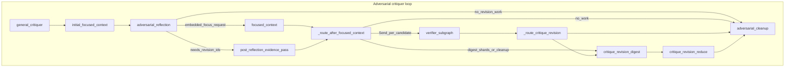
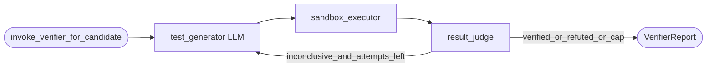

# Self-healing verifier subgraph

This document summarizes the **external verifier** work: runtime proof attempts in Docker, how they connect to the adversarial reviewer graph, configuration, artifacts, and how to build the test image.

## Goals

- Run **optional** Python probes in an isolated container (repo mounted read-only at `/repo`) for candidates that need stronger evidence after reflection.
- Keep verifier output **advisory**: promotion rules stay driven by reflection + critique revision; verifier results inform digests and lifecycle metadata, not hard drops on `refuted`.
- **Defect and security runs by default** when the verifier is enabled: `REVIEW_VERIFIER_ENABLED` defaults on; `REVIEW_VERIFIER_RUN_ON_SECURITY` defaults on so `security_risk` candidates (e.g. ReDoS) are eligible for sandbox probes. Disable per environment if you want diff-only reviews.

## Reflection routing

- Use verdict **`needs_verification`** (see reflection prompts) when runtime Python proof is needed; the graph routes those candidates toward the verifier path instead of only Graph-RAG `text_queries`.

## What changed (high level)

| Area | Change |
|------|--------|
| **Schemas** | [`src/domain/verifier_schemas.py`](../src/domain/verifier_schemas.py) — `VerifierReport`, `VerifierAttemptRecord`, `VerifierTestGeneratorOutput`. |
| **Graph state** | [`src/domain/state.py`](../src/domain/state.py) — `verifier_candidate` (Send payload), `verifier_reports` (list reducer). |
| **Sandbox** | [`src/infrastructure/sandbox.py`](../src/infrastructure/sandbox.py) — `SandboxExecResult`, `execute_result()` (exit code + demuxed stdout/stderr), `write_file_in_container()` for `/tmp` scripts. |
| **Verifier runtime** | [`src/orchestration/nodes/verifier/`](../src/orchestration/nodes/verifier/) — LLM test generation, Docker execution with timeout, deterministic judgment + retry loop (max attempts from settings). |
| **Orchestration** | [`src/orchestration/verifier_graph.py`](../src/orchestration/verifier_graph.py) — `run_verifier_invocation()` helper; `build_verifier_graph()` reserved. |
| **Routing** | [`src/orchestration/routing/verifier_fanout.py`](../src/orchestration/routing/verifier_fanout.py) — eligibility, `Send` fan-out, `make_verifier_subgraph_node`. [`src/orchestration/routing/adversarial_after_reflection.py`](../src/orchestration/routing/adversarial_after_reflection.py) — `route_focused_after_reflection` (second focused fetch vs `post_reflection_evidence_pass` vs cleanup). |
| **Reviewer graph** | [`src/orchestration/reviewer_graph.py`](../src/orchestration/reviewer_graph.py) — `post_reflection_evidence_pass` no-op bridge, `focused_context` and bridge both feed `_route_after_focused_context` (verifier then critique revision). |
| **Critique revision** | [`src/orchestration/nodes/application/critique_revision.py`](../src/orchestration/nodes/application/critique_revision.py) — optional “Runtime verifier (advisory)” sections in digest/reduce prompts. |
| **Cleanup** | [`src/orchestration/nodes/application/cleanup.py`](../src/orchestration/nodes/application/cleanup.py) — `verifier_advisory` on promoted candidate lifecycle when `metadata.verifier_hints` exists. |
| **Config** | [`src/config.py`](../src/config.py) — `REVIEW_VERIFIER_*` (verifier on by default; security-risk runs on by default; image, timeouts, `verifier_require_focused_evidence`, Docker skip, PR budget). |
| **Prompts** | [`src/orchestration/prompts/reviewer/verifier/`](../src/orchestration/prompts/reviewer/verifier/) — test generator + retry hint templates. |
| **Docker** | [`Dockerfile.verifier`](../Dockerfile.verifier), [`scripts/build_verifier_image.sh`](../scripts/build_verifier_image.sh), [`scripts/build_verifier_image.ps1`](../scripts/build_verifier_image.ps1). |
| **AACR logs** | [`src/reviewer_agent/harness/aacr.py`](../src/reviewer_agent/harness/aacr.py) — raw JSON includes `verifier_reports`. |
| **Tests** | [`src/orchestration/tests/test_verifier_integration.py`](../src/orchestration/tests/test_verifier_integration.py); [`src/infrastructure/tests/test_verifier_sandbox_integration.py`](../src/infrastructure/tests/test_verifier_sandbox_integration.py) (opt-in Docker smoke, `VERIFIER_SANDBOX_INTEGRATION=1`). |

## Reviewer graph flow (adversarial path)

The verifier sits **after** focused context gathering and **before** critique revision digest/reduce when enabled and eligible. A **post-reflection bridge** ensures verifier/critique routing still runs when reflectors return `needs_context` **without** embedding a `focused_request` (previously the graph jumped straight to cleanup and never hit verifier/critique).



Notes:

- `_route_after_focused_context` tries **verifier** `Send` branches first; if none, it delegates to existing **critique revision** routing (`_route_critique_revision`).
- `verifier_subgraph` merges parallel branches into `verifier_reports` and updates `metadata.verifier` / `metadata.verifier_hints`.

## Verifier single-candidate loop (internal)

Retries are **inside** one invocation per candidate (not LangGraph edges in the parent graph).



## Configuration quick reference

| Env / setting | Role |
|---------------|------|
| `REVIEW_VERIFIER_ENABLED` | Master switch (default **on**; set `false` to skip). |
| `REVIEW_VERIFIER_IMAGE` | Image tag (default `verifier-test-env:latest`). |
| `REVIEW_VERIFIER_RUN_ON_DEFECT` / `_SECURITY` / `_PERFORMANCE` | Claim-type gates (`_SECURITY` defaults **on**). |
| `REVIEW_VERIFIER_REQUIRE_FOCUSED_EVIDENCE` | If `true`, require focused snippets/hits for that candidate; if `false`, allow diff + candidate JSON only. |
| `REVIEW_VERIFIER_SKIP_IF_NO_DOCKER` | Skip verifier when Docker is unreachable. |

## Building the verifier image (manual)

From repository root:

```bash
# Linux / macOS
./scripts/build_verifier_image.sh
```

```powershell
# Windows
.\scripts\build_verifier_image.ps1
```

The default main `RepoSandbox` image (`agent-fs-sandbox`) is **not** built by this repo; only the verifier image is defined by `Dockerfile.verifier`.

## Opt-in integration test

```bash
VERIFIER_SANDBOX_INTEGRATION=1 pytest src/infrastructure/tests/test_verifier_sandbox_integration.py -m integration
```

Requires Docker and a locally built (or pullable) verifier image matching `REVIEW_VERIFIER_IMAGE`.
