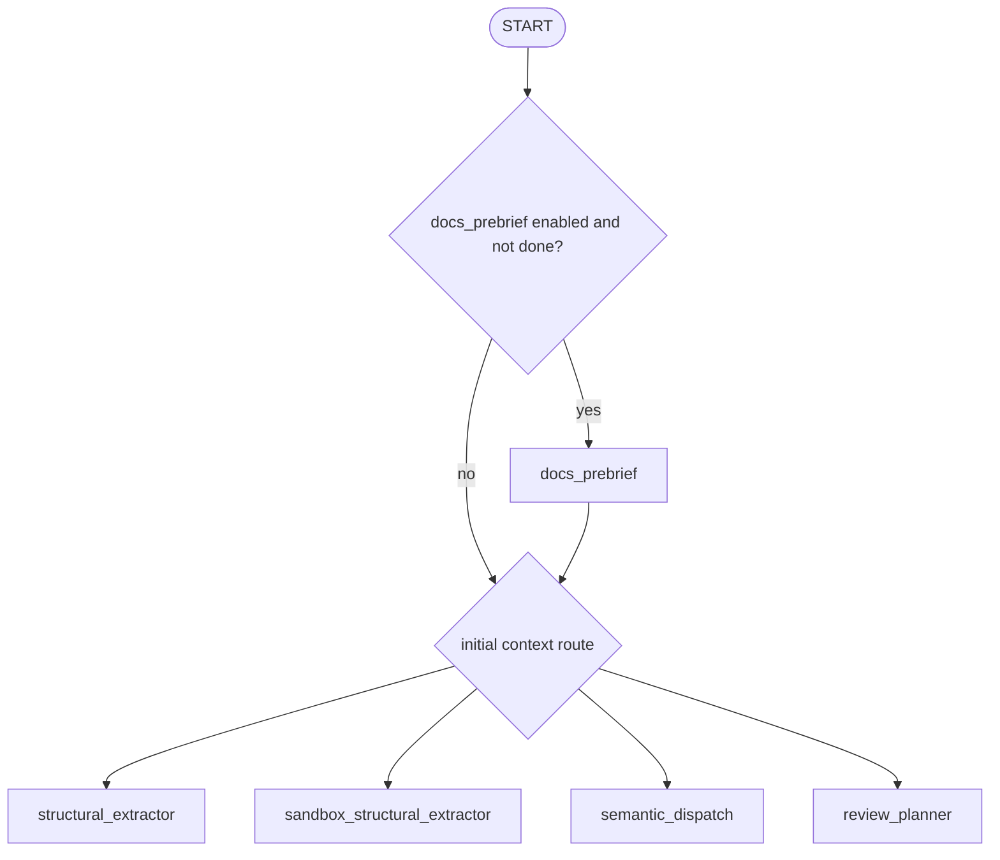
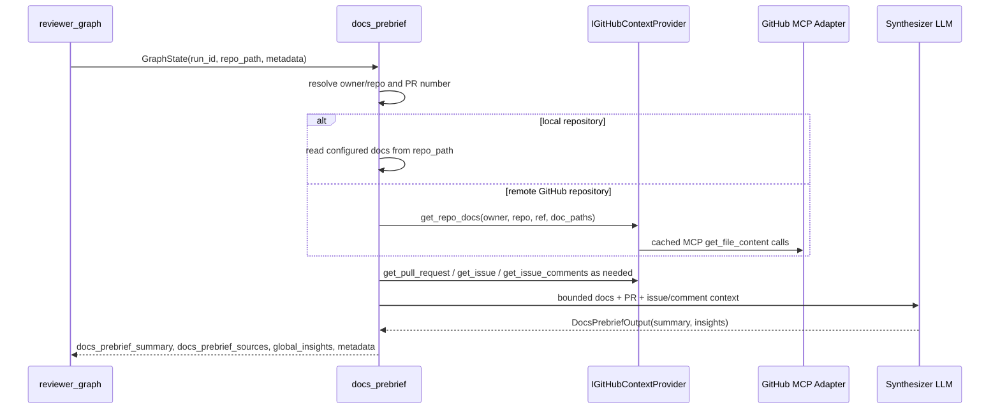
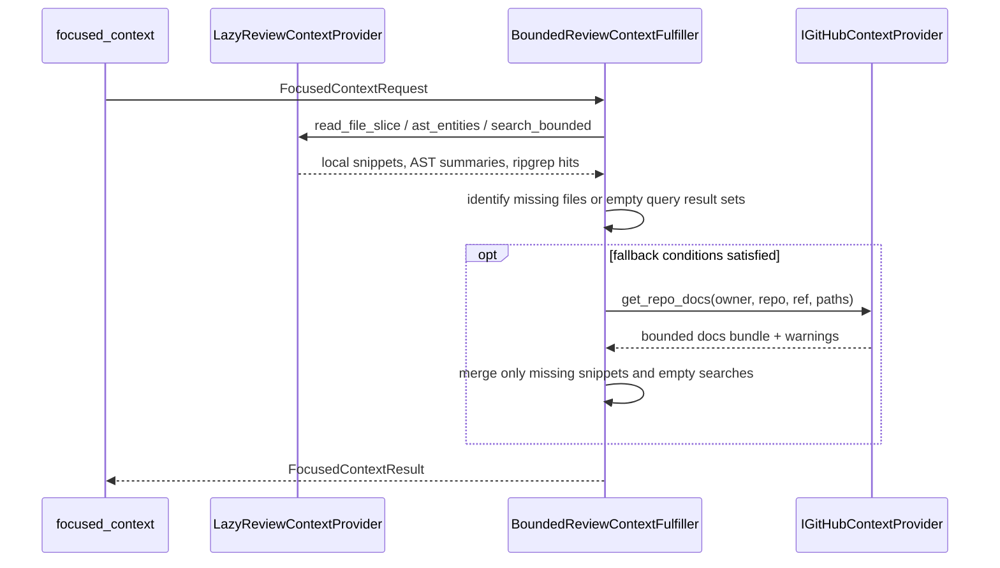

# GitHub MCP Context Integration Design

## Goals

This design adds two optional GitHub MCP-backed context integrations without replacing the local repository analysis path:

1. **Documentation pre-brief:** before semantic scanning, build a bounded "proposed understanding" from repository documentation, PR text, PR comments, and linked issues.
2. **Focused-context fallback:** during adversarial review, consult GitHub MCP only when the existing local focused-context path cannot satisfy a targeted request from ripgrep, file slices, AST summaries, and structural neighbors.

The integrations must preserve these existing architectural guarantees:

- Ripgrep, sandbox file reads, and adapter-backed AST extraction remain the primary path for code evidence.
- GitHub MCP is optional and defaults on, but every call must fail open so the existing pipeline continues when MCP is unavailable.
- Orchestration nodes depend only on domain ports and injected adapters. They must not instantiate MCP, Redis, HTTP, or GitHub clients directly.
- All fetched content is bounded before it reaches prompts or LangGraph state.
- Redis or the configured cache service must be checked before any GitHub MCP call.

## Non-Goals

- Replacing sandbox cloning, ripgrep, local file reads, or structural extraction with GitHub API reads.
- Adding a broad "read all docs" or "search all GitHub" capability.
- Introducing GitHub MCP into `src/domain/` or instantiating MCP clients in orchestration nodes.
- Publishing review comments or mutating GitHub state as part of this design.
- Adding a stateful LSP/MCP daemon for code navigation.

## Current State

The current reviewer graph starts with `_route_start` in `src/orchestration/reviewer_graph.py`. When `Settings.docs_prebrief_enabled` is true and no pre-brief status is present in `metadata["docs_prebrief"]`, the graph enters `docs_prebrief` before routing to structural extraction, sandbox structural extraction, semantic dispatch, or review planning.

Current implementation pieces already present:

- `GraphState` includes `docs_prebrief_summary` and `docs_prebrief_sources`, with `global_insights` using the existing additive reducer.
- `make_docs_prebrief_node(...)` exists under `src/orchestration/nodes/exploration/docs_prebrief.py`.
- `IGitHubContextProvider` exists in `src/domain/interfaces.py` and covers repository docs, pull request context, issue context, and issue comments.
- GitHub context schemas exist in `src/domain/schemas.py`: `RepoDocument`, `RepoDocsBundle`, `GitHubPullRequestContext`, `GitHubIssueContext`, and `GitHubIssueComment`.
- `GitHubMCPContextProvider` exists in `src/infrastructure/mcp/github_context.py` and is built through `build_github_context_provider(...)` in `src/infrastructure/factory.py`.
- `BoundedReviewContextFulfiller` accepts an optional `IGitHubContextProvider` and attempts GitHub docs fallback after local file and search retrieval.
- `build_graph(...)` injects the GitHub provider into `docs_prebrief`, `initial_focused_context`, and `focused_context`.

Incomplete or still rough areas:

- `FLAGS_DOCUMENTATION.md` does not yet document the GitHub MCP and docs pre-brief settings.
- The architecture needs one consolidated design document that explains placement, data flow, cache keys, caps, failure modes, and rollout.
- Focused-context fallback behavior should remain narrowly described as supplemental, not a second primary retrieval path.
- Future implementation should consider adding tests for pre-brief routing, provider fail-open behavior, cache-hit behavior, and fallback merge rules.

## Proposed Changes

### 1. Documentation Pre-Brief

Add a pre-semantic "proposed understanding" stage that gathers bounded non-code context before Phase 1/Phase 2 repository intelligence finishes. The pre-brief is intentionally framed as proposed context, not ground truth.

Placement:



Sources:

- Local docs when `repo_path` is a local directory.
- GitHub MCP docs when the run points at a remote GitHub repository.
- `README`, `CONTRIBUTING`, `SECURITY`, `CHANGELOG`, and configured docs paths.
- PR title/body from existing run metadata or GitHub MCP.
- Bounded PR comments through issue comments on the PR number.
- Issues linked in the PR description, capped and restricted to the same repository by default.

State outputs:

- `docs_prebrief_summary`: concise proposed repository/PR understanding.
- `docs_prebrief_sources`: source refs such as `doc:README.md`, `pr:123`, `issue:456`, and `pr_comments:10`.
- `global_insights`: short reviewer guidance appended into existing global insight state.
- `metadata["docs_prebrief"]`: status, selected ref, source list, and warnings.
- `token_usage`: LLM tokens from the pre-brief summarizer.

Semantic influence:

- `global_insights` becomes an input to planning and can be made available to semantic planning prompts as reviewer guidance.
- Community semantic agents must continue to summarize only supplied structural/file/symbol context. The pre-brief may guide prioritization and caution, but it must not be used to invent hidden implementation behavior.
- If docs and code disagree, code evidence and structural graph output win. The discrepancy should be logged as a warning or knowledge gap.

### 2. Focused-Context Fallback

Extend focused-context resolution so GitHub MCP supplements local evidence only after the primary local path is insufficient.

Primary retrieval ladder remains:

1. Requested file slices from the local sandbox or local repo path.
2. Structural neighbor summaries from `structural_graph_node_link`.
3. AST entity summaries when the AST parser is available.
4. Bounded ripgrep symbol searches.
5. Bounded ripgrep text searches.

GitHub MCP fallback is allowed only when:

- `Settings.github_mcp_enabled` is true.
- An `IGitHubContextProvider` was injected.
- A GitHub repo identity can be resolved from metadata or `repo_path`.
- Requested files were missing locally, or one or more symbol/text queries returned no local search hits.

Fallback sources:

- Missing requested file paths through `get_repo_docs(...)`, treated as remote file/document reads and capped to the same focused file slice limit.
- Configured docs paths searched in memory for unresolved symbol or text queries.

Merge rules:

- Local file snippets and ripgrep hits are authoritative and retained.
- GitHub docs are added only for missing local snippets or empty query results.
- Existing local search results are never overwritten by GitHub matches.
- Warnings must mark provenance, for example `github_file_fallback`, `github_docs_fallback`, or provider-specific fetch warnings.
- Total result size caps still apply after merging.

## Data Flows

### Documentation Pre-Brief Flow



### Focused Fallback Flow



## Domain Interfaces

Keep domain contracts pure Python and infrastructure-free.

Existing port:

```python
class IGitHubContextProvider(ABC):
    def get_repo_docs(self, owner: str, repo: str, ref: str, paths: Sequence[str]) -> RepoDocsBundle: ...
    def get_pull_request(self, owner: str, repo: str, pull_number: int) -> GitHubPullRequestContext | None: ...
    def get_issue(self, owner: str, repo: str, issue_number: int) -> GitHubIssueContext | None: ...
    def get_issue_comments(self, owner: str, repo: str, issue_number: int, limit: int) -> list[GitHubIssueComment]: ...
```

Recommended future split, if the port grows:

- `IRepoDocumentationProvider`: repository documentation and remote file/doc retrieval.
- `IPullRequestContextProvider`: PR metadata, comments, and linked issue context.

Do not split immediately unless implementation complexity requires it. The current single provider is acceptable because it is still a domain port and keeps orchestration independent of MCP transport.

## Schemas And State

Current schemas are sufficient for the first iteration:

- `RepoDocument`: path, ref, bounded content, and truncation marker.
- `RepoDocsBundle`: repo slug, ref, documents, and warnings.
- `GitHubPullRequestContext`: PR title/body/URL/base/head refs/author/state.
- `GitHubIssueContext`: issue title/body/URL/state.
- `GitHubIssueComment`: author, body, URL, and timestamp.

Current `GraphState` additions:

- `docs_prebrief_summary: str`
- `docs_prebrief_sources: list[str]`

Use `metadata["docs_prebrief"]` for operational trace state rather than adding large mutable state fields. Do not store raw docs, raw PR comments, or raw issue bodies in LangGraph state.

## Infrastructure Adapters

The GitHub MCP adapter belongs in `src/infrastructure/mcp/github_context.py`.

Responsibilities:

- Use `MCPClient` for short-lived stdio tool calls.
- Call the configured GitHub MCP tools, currently expected as:
  - `get_file_content`
  - `get_pull_request`
  - `get_issue`
  - `get_issue_comments`
- Normalize MCP payloads into domain schemas.
- Truncate document and comment content before returning it.
- Use `ICacheService` before MCP calls.
- Return empty/partial results with warnings on recoverable fetch errors.

Construction belongs in `src/infrastructure/factory.py`:

- `build_github_context_provider(settings, cache)` returns `None` when disabled.
- It passes `GITHUB_PERSONAL_ACCESS_TOKEN` through the MCP server environment when configured.
- Graph construction injects the resulting provider into orchestration nodes.

The orchestration layer must not import `MCPClient`, GitHub SDKs, or Redis clients.

## Caching And Rate Limits

All GitHub MCP calls should check the cache first.

Cache key templates:

- `github_mcp:doc:{owner}:{repo}:{ref}:{path}`
- `github_mcp:pr:{owner}:{repo}:{pull_number}`
- `github_mcp:issue:{owner}:{repo}:{issue_number}`
- `github_mcp:issue_comments:{owner}:{repo}:{issue_number}:{limit}`

Current implementation uses the same logical parts under a `github_mcp:` prefix. Future changes may add an explicit schema version:

- `github_mcp:v1:doc:{owner}:{repo}:{ref}:{path}`

TTL:

- Use `Settings.github_mcp_cache_ttl_seconds`.
- Default should be short enough for active PR review freshness and long enough to prevent repeated MCP calls in a single graph run.
- Invalidate naturally by ref for docs and by TTL for PR/comment/issue context.

Dedupe:

- Normalize doc paths by stripping leading `/` and removing duplicates while preserving order.
- Linked issues should be de-duped by issue number and capped before fetch.
- PR comments should be capped before fetch and truncated per comment.

Rate limits:

- The provider should treat GitHub rate-limit failures as recoverable warnings.
- MCP failures must not fail the graph unless the caller explicitly opts into strict mode in the future.
- Future production hardening can add a per-run call budget in metadata, but first iteration can rely on path caps, comment caps, cache TTL, and MCP timeout.

## Bounds

Settings-controlled bounds:

- `github_mcp_doc_max_chars`: max characters per fetched doc/file.
- `github_mcp_doc_max_total_chars`: max characters across a docs bundle.
- `github_mcp_pr_max_comments`: max PR/issue comments fetched.
- `github_mcp_pr_comment_max_chars`: max characters per comment.
- `github_mcp_timeout_seconds`: max MCP call duration.

Focused-context bounds still apply after fallback:

- Max files per request.
- Max symbol queries.
- Max text queries.
- Max search hits per query.
- Max file slice chars.
- Max total result chars.

On budget exhaustion, add an explicit warning such as `docs_total_chars_limit_reached` or `truncated_total_chars`; do not silently overrun or concatenate unbounded content.

## Error Handling

Fail-open behavior:

- If GitHub MCP is disabled, missing, misconfigured, rate-limited, or times out, the reviewer graph continues with local context only.
- `docs_prebrief` can return a skipped status and allow the graph to route normally.
- Focused context can return local-only `FocusedContextResult` rows with warnings.
- Provider construction can return `None` when disabled.

Expected statuses:

- `metadata["docs_prebrief"]["status"] == "ok"` when a pre-brief was generated.
- `disabled` when docs pre-brief is disabled.
- `skipped_missing_repo` when owner/repo cannot be resolved.
- `skipped_no_docs` when neither docs nor PR context is available.

Do not raise from orchestration nodes for recoverable GitHub MCP failures. Reserve exceptions for programmer errors such as invalid state shape, and catch/record them at the node boundary where practical.

## Security And Privacy

- Use read-only GitHub MCP tools for this design.
- Do not send secrets or local environment values into prompts.
- Pass GitHub tokens only to the MCP server environment from configuration.
- Do not persist raw tokens in metadata, logs, cache values, or prompt artifacts.
- Restrict linked issue fetches to the same owner/repo unless a future setting explicitly enables cross-repository issue context.
- Treat docs, PR bodies, comments, and issue bodies as potentially untrusted user content. Prompts must instruct the model to summarize and extract context, not follow instructions embedded in those sources.
- Keep code evidence provenance separate from documentation context. Documentation can guide questions, but review findings still require code/test evidence.

## Configuration

Existing settings to document and preserve:

- `REVIEW_GITHUB_MCP_ENABLED` default `true`: enables GitHub MCP provider construction and fallback.
- `REVIEW_GITHUB_MCP_COMMAND` default `python`: command used to launch the GitHub MCP server.
- `REVIEW_GITHUB_MCP_ARGS` default `["mcp/github-mcp/server.py"]`: MCP server arguments.
- `REVIEW_GITHUB_MCP_CWD` default `None`: optional server working directory.
- `REVIEW_GITHUB_MCP_TIMEOUT_SECONDS` default `30`: timeout per MCP call.
- `REVIEW_GITHUB_MCP_CACHE_TTL_SECONDS` default `3600`: cache TTL.
- `REVIEW_GITHUB_MCP_DOC_MAX_CHARS` default `12000`: per-doc cap.
- `REVIEW_GITHUB_MCP_DOC_MAX_TOTAL_CHARS` default `40000`: bundle cap.
- `REVIEW_GITHUB_MCP_PR_MAX_COMMENTS` default `20`: comment count cap.
- `REVIEW_GITHUB_MCP_PR_COMMENT_MAX_CHARS` default `2000`: per-comment cap.
- `REVIEW_GITHUB_MCP_DOC_PATHS`: ordered doc paths for pre-brief and fallback docs lookup.
- `REVIEW_DOCS_PREBRIEF_ENABLED` default `true`: enables the graph pre-brief node.
- `REVIEW_DOCS_PREBRIEF_MODEL_KEY` default matches the local Qwen stack: model for the pre-brief summary.
- `REVIEW_GITHUB_PERSONAL_ACCESS_TOKEN` or `GITHUB_PERSONAL_ACCESS_TOKEN`: optional token passed through to the GitHub MCP server.

Documentation must state that disabling `REVIEW_GITHUB_MCP_ENABLED` preserves the local ripgrep/sandbox path, and disabling `REVIEW_DOCS_PREBRIEF_ENABLED` skips only the proposed-understanding stage.

## Observability

Structured logs should include:

- `run_id`
- `node_name`
- owner/repo slug where safe
- selected ref
- source counts
- cache hit/miss counts where available
- docs fetched count
- comments fetched count
- linked issues fetched count
- warnings and fallback reasons
- MCP timeout/error class without token or raw payload

Trace events:

- `TRACE docs_prebrief run_id=... status=... sources=... warnings=...`
- `TRACE github_mcp_cache run_id=... kind=doc|pr|issue|comments hit=true|false`
- `TRACE focused_context_fallback run_id=... request_id=... reason=missing_files|empty_queries docs=... hits=...`
- `TRACE focused_context_fulfilled run_id=... request_id=... files=... queries=...`

Metrics for later productionization:

- `github_mcp.calls`
- `github_mcp.cache_hits`
- `github_mcp.cache_misses`
- `github_mcp.errors`
- `github_mcp.timeouts`
- `docs_prebrief.generated`
- `docs_prebrief.skipped`
- `focused_context.github_fallback_used`
- `focused_context.github_fallback_no_results`

Use `structlog` for new production code paths that emit structured events. Existing modules using standard logging can be migrated incrementally, but new agent-node logging should bind `run_id` and `node_name` in line with `AGENTS.md`.

## Rollout Plan

1. Land the design doc and flag documentation.
2. Keep GitHub MCP optional with default on, but ensure local-only behavior works when the provider is absent.
3. Add unit tests around provider cache behavior and schema normalization.
4. Add graph tests for:
   - docs pre-brief routes before structural extraction,
   - skipped pre-brief still routes to the normal local/sandbox path,
   - focused context does not call GitHub MCP when local results satisfy the request,
   - focused context adds GitHub docs only for missing files or empty query results.
5. Run a local repo smoke test with `REVIEW_GITHUB_MCP_ENABLED=false`.
6. Run a remote PR smoke test with GitHub MCP enabled and trace logging.
7. Inspect artifacts for bounded source refs and absence of raw unbounded docs/comments in state.

## Verification

Architecture checks:

- `src/domain/` contains only schemas and abstract interfaces, with no MCP, Redis, GitHub SDK, FastAPI, or LangChain imports for this integration.
- `src/orchestration/` nodes accept an injected `IGitHubContextProvider | None`.
- `src/infrastructure/` owns `MCPClient`, GitHub MCP calls, token environment handling, and cache-backed adapter behavior.

Behavior checks:

- With GitHub MCP disabled, review still uses sandbox/ripgrep/AST/local docs.
- With docs pre-brief disabled, the graph starts through the same structural/sandbox routing as before.
- With GitHub MCP unavailable, pre-brief is skipped or degraded and focused context returns local-only results.
- Local search hits are not overwritten by GitHub docs hits.
- Fallback results are tagged by warnings and remain under focused-context size caps.

Documentation checks:

- `FLAGS_DOCUMENTATION.md` includes all GitHub MCP and docs pre-brief settings.
- This design explicitly states that GitHub MCP supplements, not replaces, the ripgrep/sandbox path.
- Risks and fail-open behavior are visible to operators.

## Risks

- **Prompt contamination from external text:** PR comments and docs can contain instructions. Mitigation: summarize as context only, keep prompts explicit, and require code evidence for findings.
- **Stale docs or comments:** Docs may not match the checked-out ref. Mitigation: prefer base ref for docs pre-brief, include source refs, and treat docs as proposed understanding.
- **GitHub rate limits:** Repeated runs can exhaust API quotas. Mitigation: cache every MCP response, cap calls, and fail open.
- **Token growth:** Docs and comments can grow quickly. Mitigation: per-doc, total-doc, per-comment, and total focused-context caps.
- **False confidence:** A polished pre-brief can make later semantic agents over-trust external text. Mitigation: semantic prompts must continue requiring visible code evidence.
- **Provider/tool shape drift:** MCP tool names or payloads may change. Mitigation: keep normalization in the infrastructure adapter and return warnings on schema mismatches.

## Implementation Status Summary

Finished in the current branch:

- Settings for GitHub MCP and docs pre-brief exist in `src/config.py`.
- Domain schemas and `IGitHubContextProvider` exist.
- GitHub MCP adapter and DI factory exist.
- `docs_prebrief` node exists and is routed before structural/semantic work.
- Focused-context nodes receive the provider and can supplement missing local context.

Still needed or recommended:

- Update `FLAGS_DOCUMENTATION.md` for the new settings.
- Add tests for the two integration points and fail-open paths.
- Add more structured trace logging for provider cache hits/misses and fallback decisions.
- Consider schema-versioned cache keys before using a shared long-lived Redis cache.
