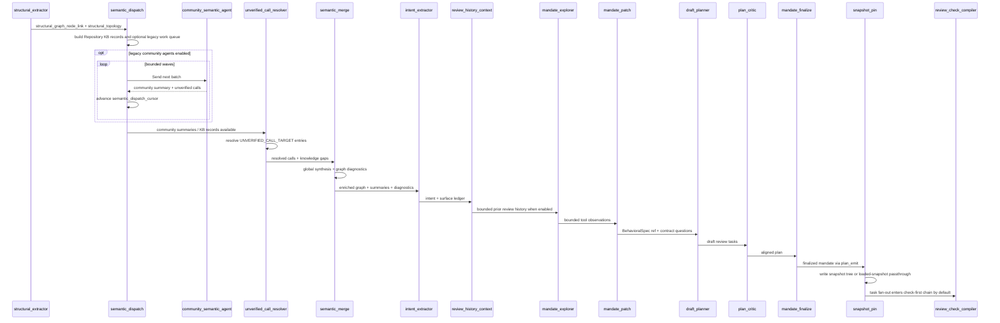

# Phase 2 Semantic Orchestration

This document shows the reviewer graph with semantic enrichment between structural extraction and review planning.

Current implementation note: live runs use a filesystem-backed Repository Knowledge Base as the primary repository-understanding layer. The broad `community_semantic_agent` fanout remains available as a compatibility path, but it is disabled by default with `REVIEW_SEMANTIC_LEGACY_COMMUNITY_AGENTS_ENABLED=false`.

## End-to-End Reviewer Graph

```mermaid
flowchart TD
    Start([START])

    Start --> DocsPrebrief{docs_prebrief enabled and not done?}
    DocsPrebrief -->|yes| DocsPrebriefNode[docs_prebrief]
    DocsPrebrief -->|no| RouteInitial{_route_initial_context}
    DocsPrebriefNode --> RouteInitial

    RouteInitial -->|"local repo_path"| StructuralExtractor[structural_extractor]
    RouteInitial -->|"remote PR sandbox"| SandboxStructuralExtractor[sandbox_structural_extractor]
    RouteInitial -->|"precomputed graph + no snapshot"| SemanticDispatch[semantic_dispatch]
    RouteInitial -->|"precomputed snapshot or semantic disabled"| IntentExtractor[intent_extractor]

    StructuralExtractor --> RouteAfterStructural{_route_after_structural}
    SandboxStructuralExtractor --> RouteAfterStructural
    RouteAfterStructural -->|"semantic enabled + topology exists + no snapshot_root"| SemanticDispatch
    RouteAfterStructural -->|"semantic disabled or missing topology"| IntentExtractor

    subgraph phase2 [Phase 2: Repository KB And Semantic Merge]
        SemanticDispatch --> RouteSemanticDispatch{route_semantic_dispatch}
        RouteSemanticDispatch -->|"legacy enabled: next bounded wave"| CommunityAgents["community_semantic_agent wave"]
        CommunityAgents -->|"wave complete, advance cursor"| SemanticDispatch
        RouteSemanticDispatch -->|"queue exhausted or legacy disabled"| UnverifiedResolver[unverified_call_resolver]
        UnverifiedResolver -->|"new targets, capped rounds"| UnverifiedResolver
        UnverifiedResolver -->|"resolved or exhausted"| SemanticMerge[semantic_merge]
        SemanticMerge --> IntentExtractor
    end

    IntentExtractor --> ReviewHistory[review_history_context]
    ReviewHistory --> MandateExplorer[mandate_explorer]
    ReviewHistory --> MandatePatch[mandate_patch]
    MandateExplorer --> MandatePatch
    MandatePatch --> DraftPlanner[draft_planner]
    MandatePatch --> PlanRevision[plan_revision]
    DraftPlanner --> PlanCritic[plan_critic]
    PlanRevision --> PlanCritic
    PlanCritic --> MandateFinalize[mandate_finalize]
    PlanCritic --> TargetedExplorer[mandate_explorer_targeted]
    PlanCritic --> PlanRevision
    TargetedExplorer --> MandatePatch
    MandateFinalize --> PlanEmit[plan_emit]
    PlanEmit --> SnapshotPin[snapshot_pin]
    SnapshotPin --> ReviewDispatch{task dispatch}

    subgraph review [Review Planning and Adversarial Review]
        ReviewDispatch --> CritiqueSubgraph[critique_review_subgraph]
        CritiqueSubgraph --> InitialFocusedContext[initial_focused_context]
        InitialFocusedContext --> EvidenceTriage[review_evidence_triage]
        EvidenceTriage --> Reflection[adversarial_reflection]
        Reflection -->|"needs context"| FocusedContext[focused_context]
        Reflection -->|"needs verification/revision"| PostReflectionEvidence[post_reflection_evidence_pass]
        Reflection -->|"ready"| Adjudicator[review_adjudicator]
        FocusedContext --> AfterFocused{verifier or critique revision}
        PostReflectionEvidence --> AfterFocused
        AfterFocused -->|"runtime proof"| Verifier[verifier_subgraph]
        Verifier --> PostVerifierGate[post_verifier_gate]
        PostVerifierGate --> CritiqueRevisionRoute{critique revision route}
        AfterFocused -->|"no verifier work"| CritiqueRevisionRoute
        CritiqueRevisionRoute -->|"revision shards"| CritiqueDigest[critique_revision_digest]
        CritiqueDigest --> CritiqueReduce[critique_revision_reduce]
        CritiqueReduce --> Adjudicator
        CritiqueRevisionRoute -->|"no revision needed"| Adjudicator
        Adjudicator --> Synthesizer[review_synthesizer]
    end

    Synthesizer --> End([END])
```



## Phase 2 Control Flow



## Important Settings

- `REVIEW_SEMANTIC_ENRICHMENT_ENABLED`: enables or skips Phase 2.
- `REVIEW_SEMANTIC_LEGACY_COMMUNITY_AGENTS_ENABLED`: enables the older broad community-agent fanout.
- `REVIEW_REPOSITORY_KB_DISTILLATION_MODE`: controls Repository KB enrichment mode.
- `REVIEW_REPOSITORY_KB_INTELLIGENCE_PROFILE`: sets the adaptive Repository KB effort profile.
- `REVIEW_SEMANTIC_MAX_PARALLEL_AGENTS`: max concurrent legacy community LLM calls per wave.
- `REVIEW_SEMANTIC_AGENT_MAX_RETRIES`: retries per community before degraded summary.
- `REVIEW_SEMANTIC_AGENT_RETRY_BACKOFF_SECONDS`: base retry backoff.
- `REVIEW_SEMANTIC_MODEL_KEY`: model key for community agents.
- `REVIEW_SEMANTIC_MERGE_MODEL_KEY`: model key for global semantic synthesis.
- `REVIEW_SNAPSHOT_BASE_PATH`: root directory for snapshot disk trees.

## Snapshot Output

`snapshot_pin` writes a filesystem-safe run directory under `snapshot_base_path`, while preserving the original `run_id` in `snapshot.json`.

```text
bushwhack_runs/{safe_run_id}/
|-- snapshot.json
|-- graph/
|   |-- full_graph.json
|   |-- topology.json
|   |-- cross_community_edges.json
|   `-- communities/
|-- semantic/
|   |-- global_summary.md
|   |-- diagnostics.json
|   `-- communities/
`-- literal/
```

Redis stores only the microscopic pointer:

```json
{
  "run_id": "original_run_id",
  "snapshot_id": "snapshot_hash",
  "snapshot_root": "path/to/bushwhack_runs/safe_run_id",
  "status": "exploration_complete"
}
```
