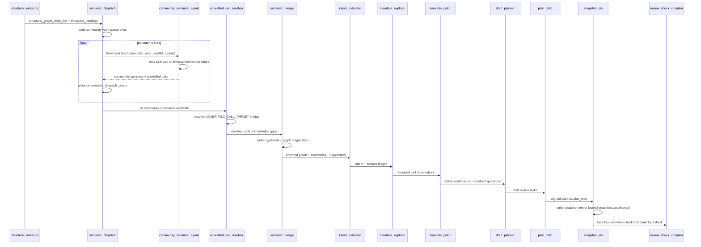

# Phase 2 Semantic Orchestration

This document shows the reviewer graph with the Phase 2 semantic bubble-up phase inserted between structural extraction and review planning.

Note: the current implementation now uses a filesystem-backed Repository Knowledge Base as the primary repository understanding layer. The broad `community_semantic_agent` fanout remains as a compatibility path, but new live runs build deterministic KB records and KB-derived community summaries first. See [repository_kb_architecture.md](repository_kb_architecture.md) for the current repository-scoped design and [review_kb_architecture.md](review_kb_architecture.md) for earlier migration context.

## End-to-End Reviewer Graph

```mermaid
flowchart TD
    Start([START])

    Start --> RouteInitial{_route_initial_context}
    RouteInitial -->|"local repo_path"| StructuralExtractor[structural_extractor]
    RouteInitial -->|"remote PR sandbox"| SandboxStructuralExtractor[sandbox_structural_extractor]
    RouteInitial -->|"precomputed graph + no snapshot"| SemanticDispatch[semantic_dispatch]
    RouteInitial -->|"precomputed snapshot or semantic disabled"| IntentExtractor[intent_extractor]

    StructuralExtractor --> RouteAfterStructural{_route_after_structural}
    SandboxStructuralExtractor --> RouteAfterStructural
    RouteAfterStructural -->|"semantic enabled + topology exists + no snapshot_root"| SemanticDispatch
    RouteAfterStructural -->|"semantic disabled or missing topology"| IntentExtractor

    subgraph phase2 [Phase 2: Agentic Semantic Bubble-Up]
        SemanticDispatch --> RouteSemanticDispatch{route_semantic_dispatch}
        RouteSemanticDispatch -->|"next bounded wave"| CommunityAgents["community_semantic_agent wave (max semantic_max_parallel_agents)"]
        CommunityAgents -->|"retry on timeout/connection error"| CommunityAgents
        CommunityAgents -->|"wave complete, advance cursor"| SemanticDispatch
        RouteSemanticDispatch -->|"queue exhausted"| UnverifiedResolver[unverified_call_resolver]
        UnverifiedResolver -->|"new targets, capped rounds"| UnverifiedResolver
        UnverifiedResolver -->|"resolved or exhausted"| SemanticMerge[semantic_merge]
        SemanticMerge --> IntentExtractor
    end

    IntentExtractor --> MandateExplorer[mandate_explorer]
    MandateExplorer --> MandatePatch[mandate_patch]
    MandatePatch --> DraftPlanner[draft_planner]
    DraftPlanner --> PlanCritic[plan_critic]
    PlanCritic --> PlanEmit[plan_emit]
    PlanEmit --> SnapshotPin[snapshot_pin]
    SnapshotPin --> ReviewDispatch{task dispatch}

    subgraph review [Review Planning and Adversarial Review]
        ReviewDispatch --> MentalModelEnricher[mental_model_context_enricher]
        MentalModelEnricher -->|"review-check-mode off"| GeneralCritiquer[general_critiquer]
        MentalModelEnricher -->|"default check-first"| ReviewCheckCompiler[review_check_compiler]
        ReviewCheckCompiler --> ReviewCheckExecutor[review_check_executor]
        ReviewCheckExecutor --> EvidenceGate[review_check_evidence_gate]
        EvidenceGate --> InitialFocusedContext[initial_focused_context]
        GeneralCritiquer --> InitialFocusedContext[initial_focused_context]
        InitialFocusedContext --> Reflection[adversarial_reflection]
        Reflection -->|"needs more context"| FocusedContext[focused_context]
        Reflection -->|"ready for adjudication"| Adjudicator[review_adjudicator]
        FocusedContext --> CritiqueRevisionRoute{critique revision route}
        CritiqueRevisionRoute -->|"revision shards"| CritiqueDigest[critique_revision_digest]
        CritiqueDigest --> CritiqueReduce[critique_revision_reduce]
        CritiqueReduce --> Adjudicator
        CritiqueRevisionRoute -->|"no revision needed"| Adjudicator
        Adjudicator --> Synthesizer[review_synthesizer]
    end

    Synthesizer --> End([END])
```



## Phase 2 Control Flow



## Important Settings

- `REVIEW_SEMANTIC_ENRICHMENT_ENABLED`: enables or skips Phase 2.
- `REVIEW_SEMANTIC_MAX_PARALLEL_AGENTS`: max concurrent community LLM calls per wave.
- `REVIEW_SEMANTIC_AGENT_MAX_RETRIES`: retries per community before degraded summary.
- `REVIEW_SEMANTIC_AGENT_RETRY_BACKOFF_SECONDS`: base retry backoff.
- `REVIEW_SEMANTIC_MODEL_KEY`: model key for community agents.
- `REVIEW_SEMANTIC_MERGE_MODEL_KEY`: model key for global semantic synthesis.
- `REVIEW_SNAPSHOT_BASE_PATH`: root directory for snapshot disk trees.

## Snapshot Output

`snapshot_pin` writes a filesystem-safe run directory under `snapshot_base_path`, while preserving the original `run_id` in `snapshot.json`.

```text
bushwhack_runs/{safe_run_id}/
├── snapshot.json
├── graph/
│   ├── full_graph.json
│   ├── topology.json
│   ├── cross_community_edges.json
│   └── communities/
├── semantic/
│   ├── global_summary.md
│   ├── diagnostics.json
│   └── communities/
└── literal/
```

Redis stores only the microscopic pointer:

```json
{
  "run_id": "original_run_id",
  "snapshot_id": "snapshot_hash",
  "snapshot_root": "path/to/bushwhack_runs/safe_run_id",
  "status": "exploration_complete"
}
```

