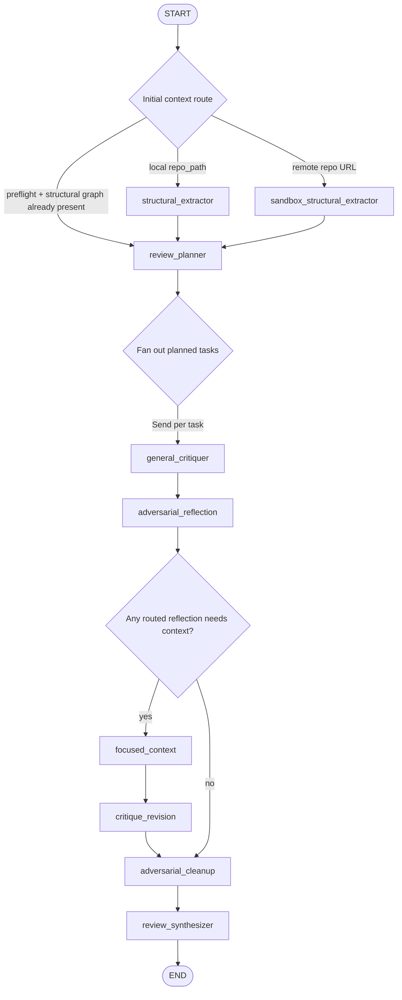

# Reviewer Orchestration

This document describes the current reviewer graph as implemented in `src/orchestration/reviewer_graph.py`, including how preflight feeds the graph and which parts are still incomplete.

## High-Level Flow

The default graph is an adversarial review pipeline:

There is also a legacy worker path behind `Settings.reviewer_use_legacy_specialist_workers`. When enabled, `review_planner` fans out directly to `security_worker`, `logic_worker`, `performance_worker`, and `general_worker`, then joins at `review_synthesizer`. The default is the adversarial path.

## Routing And State

The graph state type is `GraphState` in `src/domain/state.py`. Important channels:

- Inputs: `run_id`, `repo_path`, `git_diff`.
- Preflight and structural context: `diff_manifest_ref`, `preflight_summary`, `preflight_errors`, `preflight_warnings`, `structural_graph_node_link`, `structural_topology`, `structural_extraction_gaps`.
- Planning state: `root_task_id`, `task_registry`, `task_status_by_id`.
- Adversarial review state: `candidate_findings`, `reflection_reports`, `focused_context_requests`, `focused_context_results`.
- Outputs: `findings` and `final_findings`.
- Debugging: `metadata`, `node_history`, `token_usage`.

Parallel fan-out relies on reducers:

- List channels such as `candidate_findings`, `reflection_reports`, `findings`, and `node_history` use `operator.add`.
- Dict channels such as `task_registry`, `task_status_by_id`, and `focused_context_results` use dict union reducers.
- `metadata` uses `merge_graph_metadata`, a recursive dict merge. This is required because multiple parallel `general_critiquer` nodes update `metadata` in the same LangGraph step.

## Preflight And Structural Extraction

Preflight currently happens inside the structural extraction nodes, not as a separate graph node.

### Local Repository Path

If `repo_path` points to a local directory, `_route_initial_context` sends the run to `structural_extractor`.

`structural_extractor`:

1. Calls `preflight_service.build_diff_manifest(...)` with `PreflightRequest(run_metadata, raw_diff)`.
2. Passes the resulting manifest into `StructuralGraphBuilder.build(...)`.
3. Uses the host-side AST parser when available.
4. Optionally runs structural topology / community detection.
5. Writes:
   - `diff_manifest_ref`
   - `preflight_summary`
   - `preflight_errors`
   - `preflight_warnings`
   - `structural_graph_node_link`
   - `structural_topology`
   - `structural_extraction_gaps`
   - structural metadata

### Remote Repository Path

If `repo_path` is not a local directory, `_route_initial_context` sends the run to `sandbox_structural_extractor`.

`sandbox_structural_extractor`:

1. Calls the same `preflight_service.build_diff_manifest(...)` over the raw diff.
2. Starts or reuses a sandbox checkout through `LazyReviewContextProvider`.
3. Extracts entities inside the sandbox via `collect_structural_entities(...)`.
4. Builds the structural graph on the host from those extracted entities.
5. Optionally runs structural topology / community detection.
6. Writes the same preflight and structural state fields as the local extractor.

For remote runs, `RunMetadata.base_sha` is currently set to `"unknown"` and `head_sha` to `run_id` in the extraction node. The harness has PR metadata and commits in the dataset, but that commit metadata is not yet wired into preflight run metadata in this path.

## Review Planner

`review_planner` converts diff and structural context into executable `ReviewTask` objects.

Inputs:

- Changed files from the diff, falling back to file nodes in `structural_graph_node_link`.
- `preflight_summary`.
- Derived structural routing hints, not the raw topology payload.
- Global insights.
- A bounded diff excerpt.

Important behavior:

- The LLM planner is asked to return a flat `tasks` array.
- `_normalize_tasks(...)` still defensively flattens nested `subtasks`, because local models may return hierarchical plans anyway.
- Each executable task is stored in `task_registry`.
- The root task is stored separately as `review-root`.
- Each leaf task starts with `task_status_by_id[task.id] = "pending"`.

The planner no longer passes raw `structural_topology.model_dump()` into the prompt, because that can include thousands of node IDs and blow up model context. Instead, it uses planner-specific `Structural Routing Hints` derived from changed file neighborhoods.

## General Critiquer Fan-Out

`_route_critique_tasks` reads `task_registry` and emits one LangGraph `Send("general_critiquer", payload)` per pending leaf task, excluding `root_task_id`.

Each `general_critiquer`:

1. Loads the task identified by `current_task_id`.
2. Collects direct context with `LazyReviewContextProvider.collect_for_task(...)`.
3. Prompts the general critiquer to produce `CandidateFinding` objects.
4. Normalizes `candidate_id` and `patch_task_id`.
5. Marks the task completed in `task_status_by_id`.

The general critiquer is also responsible for routing each candidate to one or more reflector domains through `CandidateFinding.reflection_specialties`. Most findings should route to exactly one domain. Cross-domain findings can route to multiple domains.

Current limitation: `CritiquerOutput.initial_focus_requests` are recorded in metadata but are not emitted into `focused_context_requests`. The active focused-context cycle is driven by reflection reports, not by initial critiquer requests.

## Adversarial Reflection

`adversarial_reflection` no longer sends every candidate to every reflector. It groups candidates by `reflection_specialties`:

- `security`
- `logic`
- `performance`
- `general`

Fallback routing:

- If `reflection_specialties` is non-empty, it is authoritative.
- If empty, `suspected_category` is used when it matches a reflector domain.
- Otherwise the candidate routes to `general`.

Each reflector receives only candidates routed to that domain and returns `ReflectionReport` objects. This reduces cost and prevents off-domain vetoes from suppressing valid findings.

Reflection verdicts:

- `accept`
- `reject`
- `needs_context`
- `reclassify`
- `not_applicable`

If a routed domain expert returns `not_applicable`, cleanup records the candidate as misrouted and drops it. This is intentional: it exposes cases where the general critiquer assigned the wrong domain.

## Focused Context And Revision

After reflection, `_route_focused_after_reflection` checks for any `ReflectionReport` with:

- `verdict == "needs_context"`
- a non-null `focused_request`

If none exist, the graph goes directly to cleanup.

If any exist:

1. `focused_context` deduplicates and fulfills structured requests.
2. Requests are bounded by caps in `src/orchestration/context/review_context.py`:
   - max files per request: `5`
   - max text queries: `5`
   - max symbol queries: `5`
   - max search hits per query: `15`
   - max file slice chars: `8000`
   - max total result chars: `24000`
3. The fulfiller can read file slices, run bounded text searches, return AST entity summaries when available, and add structural neighbor summaries.
4. `critique_revision` performs a second-pass revision for candidates that needed context and have focused evidence.

This is a one-cycle context loop. There is no recursive agent loop.

## Cleanup And Synthesis

`adversarial_cleanup` promotes `CandidateFinding` objects into clean `ReviewFinding` objects.

Current promotion rules:

- Determine final category from candidate `suspected_category` plus relevant `reclassify` reports.
- Relevant reflectors are the candidate's routed `reflection_specialties`; if absent, the final category determines relevance.
- `reject` only blocks promotion when it comes from a relevant reflector.
- `needs_context` only blocks when it comes from a relevant reflector and focused context / revision does not support the candidate.
- Off-domain `reject` and `needs_context` reports are recorded in metadata and ignored for promotion.
- Relevant `not_applicable` reports mark the candidate as misrouted and drop it.
- Promoted findings become `findings`.

`review_synthesizer` then deduplicates and sorts `findings` into `final_findings`.

## What Is Not Complete Yet

### Preflight Is Not A First-Class Graph Node

Preflight is embedded inside structural extraction. That means it cannot yet independently:

- fail fast before structural extraction,
- be cached and resumed separately,
- be inspected as its own graph stage,
- run without also building structural context.

The graph can skip extraction if both `preflight_summary` and `structural_graph_node_link` are already present, but there is no dedicated `preflight` node that materializes a full preflight artifact into state.

### Diff Manifest Is Referenced, Not Stored

The state stores `diff_manifest_ref`, `preflight_summary`, errors, and warnings. It does not store the full `DiffManifest` object. Planner and downstream nodes therefore only see the summary and changed-file extraction helpers, not full hunk-level preflight structure.

### Preflight Metadata Is Incomplete For Remote Runs

Remote structural extraction currently constructs `RunMetadata` with:

- `base_sha = "unknown"`
- `head_sha = run_id`

For AACR / GitHub PR runs, the harness knows more precise PR metadata, including base/head commits from the dataset, but that metadata is not wired into the preflight request in the graph.

### Planner Uses Limited Preflight Signals

The planner receives only `PreflightSummary`, changed files, structural routing hints, global insights, and a diff excerpt. It does not yet consume:

- per-file preflight metrics,
- hunk boundaries,
- ambiguity flags,
- risk hints,
- parse issue details beyond summary booleans.

This limits how well preflight can guide task decomposition.

### Focused Context Does Not Use Preflight Hunks Directly

Focused context can read file prefixes/slices and run bounded search, but it does not yet use preflight hunk coordinates to retrieve exact changed regions or neighboring unchanged lines. Context gathering is therefore still file-oriented rather than hunk-oriented.

### Initial Critiquer Context Requests Are Not Executed

`CritiquerOutput` supports `initial_focus_requests`, but `general_critiquer` currently records these in metadata and returns an empty `focused_context_requests` list. Only reflection-driven `needs_context` requests are fulfilled.

### Raw Artifacts Are Better But Not Complete Provenance

The harness writes candidates, reflections, focused requests, focused results, worker reports, and metadata. It does not yet write a complete preflight manifest or exact prompt payloads / prompt sizes for each node.

## Operational Notes

- Redis checkpointing is used when `redis_enabled` is true. If Redis checkpointing fails, `run_reviewer` falls back to an in-memory graph run.
- The same `LazyReviewContextProvider` is shared across the graph run and is stopped by the wrapper around `review_synthesizer`.
- Local LLM model keys come from `Settings.reviewer_planner_model_key` and `Settings.reviewer_worker_model_key`.
- `reviewer_use_legacy_specialist_workers` can be enabled to bypass the adversarial critiquer/reflection path and use the older specialist worker fan-out.
